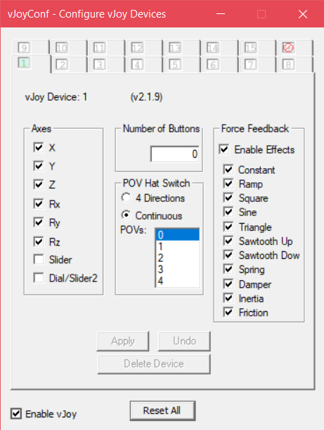

# steering-wheel-emulator
This repository maps the mouse X and Y movement to a vjoy virtual controller device. Let you play racing games with your mouse movement. 
 
Install the dependencies from the [requirement.txt](requirement.txt) 
USE code 
> pip install -r requirement.txt

### VJoy
This application uses [vjoy](https://sourceforge.net/projects/vjoystick/). 
Prepare the first device as shown  

### Run
Run the code with [program.py](program.py)
